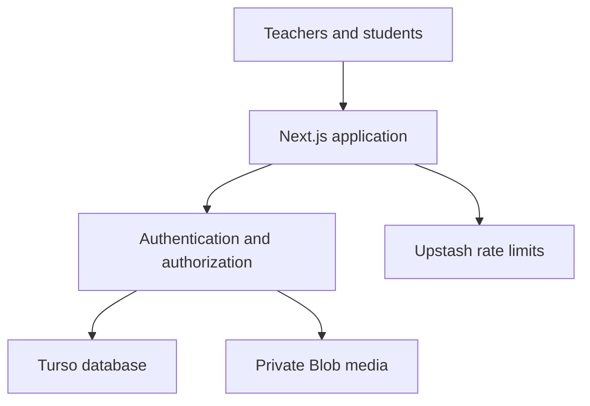

# TryHabla Security Engineering Case Study

## Executive summary

TryHabla is a production web application for language teachers to create speaking assignments, collect student recordings, review submissions, and export grades. As of September 2026, it has served 366 users, including 92 teacher accounts, 122 classes, 67 assignments, and 341 student submissions with zero paid acquisition.

I designed and implemented the application as its founder and full-stack developer. The security challenge was not theoretical: the platform handles authenticated teacher and student identities, classroom membership, student audio, grades, feedback, and optional AI-generated transcripts and grading suggestions.

This case study explains the controls implemented in the repository, the evidence behind them, and the gaps that still require operational or legal verification. It does not claim that source-code controls alone prove production compliance.

## System architecture

Optional AI transcription and grading remain behind a deployment feature gate. When disabled, the related UI is hidden and the server routes return unavailable before retrieving audio or contacting a provider.

## Security objectives

1. A teacher may access only classes, assignments, rosters, submissions, and recordings belonging to that teacher.
2. A student may access only the student's own active submissions and authorized assignments.
3. Student audio and assignment attachments must not depend on public URLs for routine access.
4. Authentication, submission, export, and administrative routes must fail closed when required configuration is missing.
5. Deletion must include both database records and associated media after a recoverable soft-delete period.
6. Optional AI processing must be explicit, gated, documented, and separable from the free classroom workflow.

## Implemented controls and evidence

| Area | Implementation | Repository evidence |
| --- | --- | --- |
| Authentication | Google OAuth through NextAuth; optional Microsoft provider support | [`auth.ts`](../auth.ts), [`proxy.ts`](../proxy.ts) |
| Teacher authorization | Teacher APIs validate the signed-in identity and class ownership before returning or changing classroom data | [`app/api/classes`](../app/api/classes), [`app/api/assignments`](../app/api/assignments) |
| Student authorization | Assignment and submission access is evaluated against the authenticated student and active records | [`lib/student-assignment-access.ts`](../lib/student-assignment-access.ts), [`app/api/student`](../app/api/student) |
| Private media | Audio retrieval passes through authorized server routes; new recording storage fails closed instead of falling back to public storage | [`lib/audio-blob.ts`](../lib/audio-blob.ts), [`app/api/submissions/[submissionId]/audio/route.ts`](../app/api/submissions/%5BsubmissionId%5D/audio/route.ts) |
| Abuse controls | Redis-backed limits protect sign-in, submissions, feedback, and gradebook export; upload size/type limits are handled separately | [`lib/rate-limit.ts`](../lib/rate-limit.ts), [`lib/upload-limits.ts`](../lib/upload-limits.ts) |
| Input and response validation | Shared validation and typed AI schemas constrain accepted input and generated output | [`lib/validation.ts`](../lib/validation.ts), [`lib/ai/schemas.ts`](../lib/ai/schemas.ts) |
| Retention and deletion | Records use a 30-day soft-delete window before scheduled hard deletion; cleanup also attempts deletion of associated media | [`app/api/cron/cleanup/route.ts`](../app/api/cron/cleanup/route.ts), [`data-retention-and-deletion.md`](data-retention-and-deletion.md) |
| Deployment safety | Release checks validate registration policy and required production conditions before a build is promoted | [`scripts/predeploy-check.mjs`](../scripts/predeploy-check.mjs), [`package.json`](../package.json) |
| Data governance | The repository identifies collected data, access paths, subprocessors, retention, and unresolved compliance gaps | [`data-inventory.md`](data-inventory.md), [`subprocessors.md`](subprocessors.md), [`compliance-gap-register.md`](compliance-gap-register.md) |
| Testing | The release command runs linting, automated tests, type checking, and a production build | [`package.json`](../package.json), [`__tests__`](../__tests__) |

## Example: protecting student recordings

The initial product needed to make browser-recorded audio available to an assigning teacher without turning each recording into a permanently public asset.

The current design stores new media in private Blob storage. A teacher requests playback through an application route, which verifies the teacher role and class ownership before returning the file. A student uses a separate route that verifies ownership of the active submission. The application does not fall back to public storage when private configuration is missing.

A guarded migration workflow inventories legacy media, performs a read-only dry run by default, requires separate database and media-backup confirmations before applying destructive changes, and rechecks for remaining public references afterward. The operational sequence is documented in the [root runbook](../README.md#private-media-release-and-migration).

## Example: diagnosing an authentication incident

In August 2026, two teachers reported that they could not complete onboarding. I investigated production logs, authentication callbacks, database records, deployment configuration, public URLs, and the browser context shown in support screenshots.

The investigation separated two failures that initially looked identical:

- Authentication succeeded for one teacher, but the application-level registration gate was closed while public copy advertised open registration.
- A second teacher reached TryHabla through an embedded social-media browser, but no OAuth request began. The evidence was consistent with the application's embedded-browser guard and an unreliable external-browser escape.

The remediation added stage-specific, privacy-safe diagnostic events; clearer embedded-browser recovery; normalized registration-policy checks; a custom authentication error experience; and a release gate that rejects an open-registration deployment when the runtime policy is closed.

The public case study intentionally omits teacher identities, email addresses, support messages, and raw production-log details. Reviewers can inspect the resulting controls in [`SignInLink.tsx`](../app/components/SignInLink.tsx), [the NextAuth route](../app/api/auth/%5B...nextauth%5D/route.ts), [the teacher-role route](../app/api/auth/role/route.ts), and [`scripts/predeploy-check.mjs`](../scripts/predeploy-check.mjs).

## Security decisions and tradeoffs

### Fail closed over silent fallback

Missing private-media or authentication configuration returns a controlled failure. The application does not silently write sensitive media to a public location or enable an unfinished AI path.

### Separate identity from authorization

Completing Google OAuth proves identity; it does not automatically grant teacher access to every classroom resource. Server routes still check role, ownership, active/deleted state, and applicable roster or domain policy.

### Treat AI output as an editable suggestion

AI grading is optional and teacher-controlled. Provider output is validated against typed schemas, saved as a reviewable attempt, and kept separate from the teacher's final grade and feedback.

### Document uncertainty

Repository evidence cannot prove live environment variables, provider regions, backup retention, contracts, or production access settings. Those items stay labeled as deployment or provider verification work instead of being presented as completed compliance.

## Known gaps

The project is in active development. Important open items include:

- User-account closure and deletion workflow.
- Verification of provider backup retention, regions, and contractual terms.
- External vulnerability assessment or penetration test.
- Formal incident-response contacts and timelines.
- Production verification of scheduled cleanup and private-storage configuration.
- Legal review of privacy and district-agreement drafts.

The current [compliance gap register](compliance-gap-register.md) tracks these items rather than hiding them.

## What this project demonstrates

- Building authorization around real user roles and object ownership.
- Protecting student media through private storage and authorized proxy routes.
- Converting privacy requirements into a data inventory and retention workflow.
- Using tests and deployment gates to prevent configuration regressions.
- Investigating an authentication incident through logs, timelines, competing hypotheses, and evidence-based conclusions.
- Communicating technical findings for teachers, district reviewers, and engineering work.

## Three-minute review path

1. Read the [district security overview](district-security-overview.md).
2. Inspect the [student data inventory](data-inventory.md).
3. Review the authentication-incident summary and linked remediation code above.
4. Open the private audio and cleanup routes linked above.
5. Review the test and release commands in [`package.json`](../package.json).
